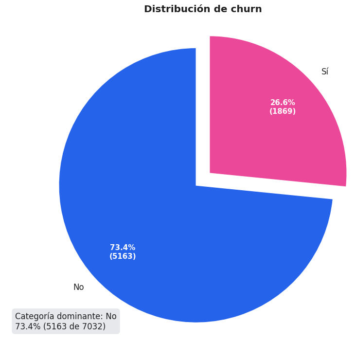
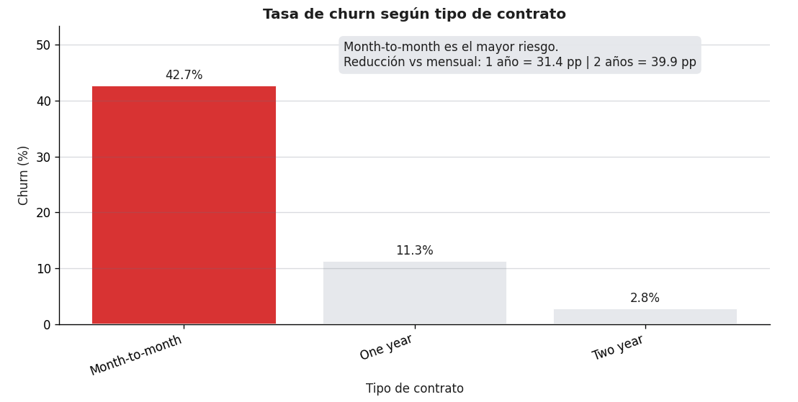
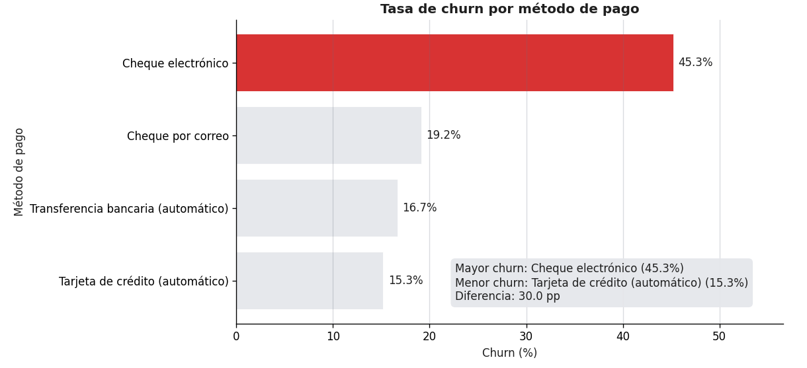
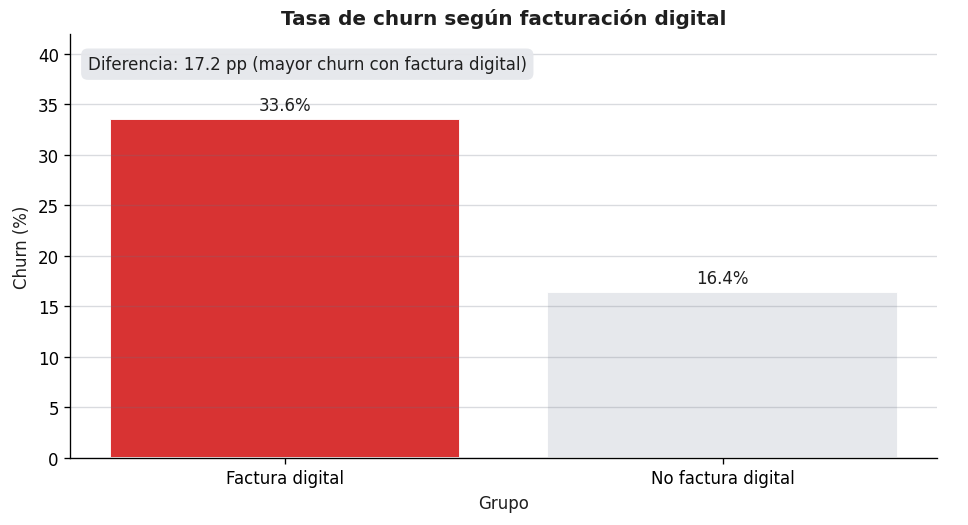
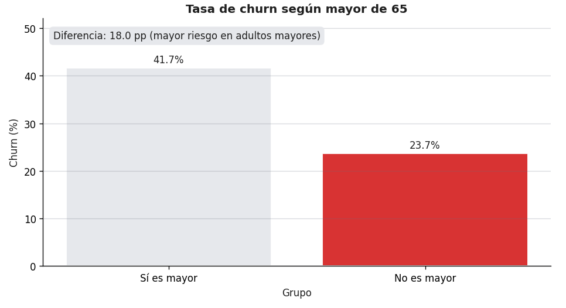
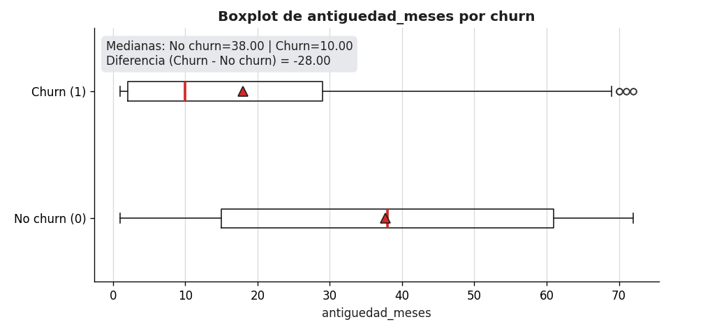
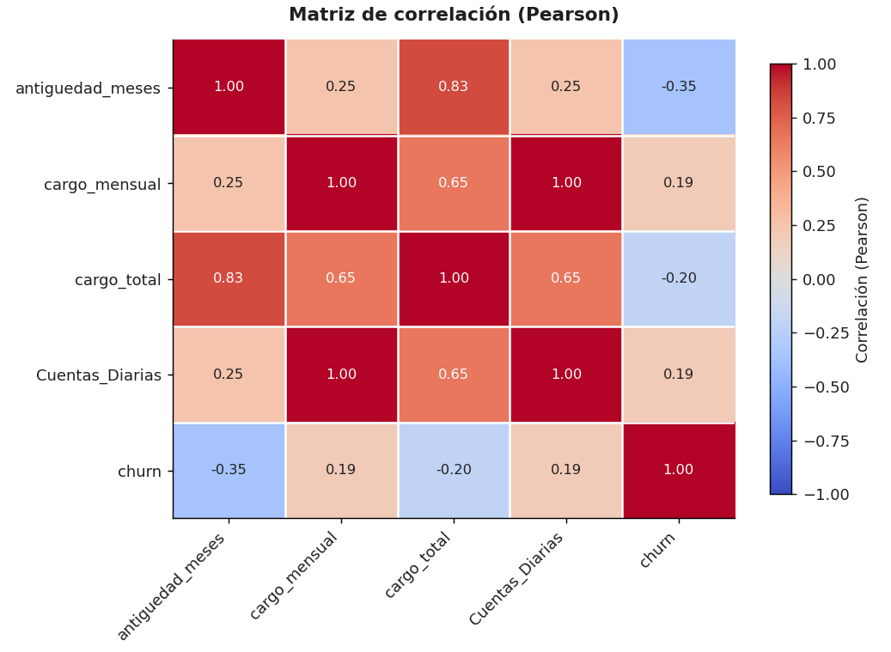
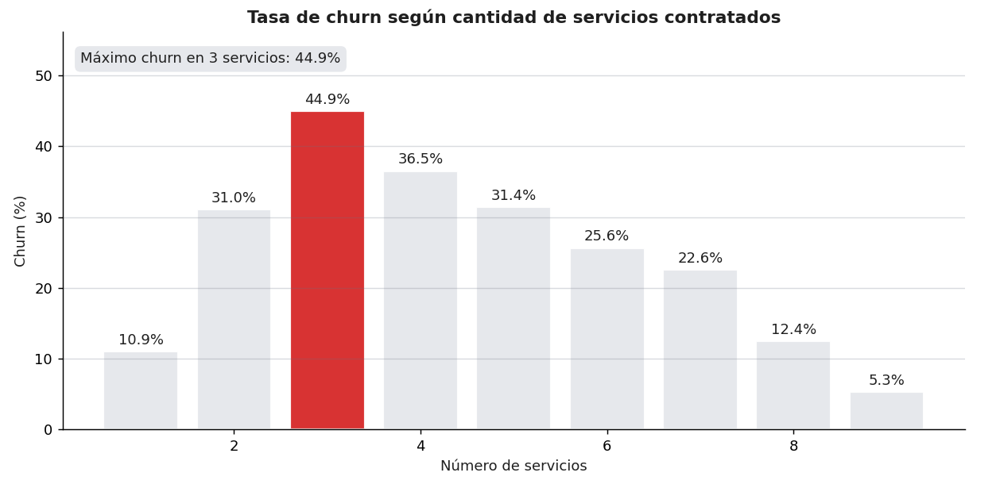

# Telecom X — Análisis Exploratorio de Churn (EDA)


## Descripción
Este proyecto realiza un **análisis exploratorio de datos (EDA)** para estudiar la **evasión de clientes (Churn)** en una empresa de telecomunicaciones.  
El objetivo es identificar patrones asociados al churn (contrato, método de pago, características del cliente, consumo y cantidad de servicios) y proponer **insights** y **recomendaciones** para reducir la cancelación del servicio.

---

## Objetivos del análisis
- Medir la proporción de clientes que abandonan el servicio (**churn**).
- Limpiar y preparar datos provenientes de un **JSON anidado**.
- Analizar variables **categóricas** y **numéricas** para detectar patrones asociados al churn.
- Explorar correlaciones (Pearson) como análisis adicional.
- Analizar el churn según la **cantidad de servicios contratados** (`num_servicios`).
- Generar conclusiones e ideas accionables para estrategias de retención.

---

## Dataset (diccionario de datos)
Principales variables incluidas (nombres pueden variar según estandarización final):
- `id_cliente`: identificador único del cliente
- `churn`: 1 si el cliente abandona, 0 si permanece
- `genero`, `mayor_65`, `tiene_pareja`, `tiene_dependientes`
- `antiguedad_meses`
- `servicio_telefonico`, `multiples_lineas`
- `servicio_internet`, `seguridad_online`, `backup_online`, `proteccion_dispositivo`, `soporte_tecnico`,
  `streaming_tv`, `streaming_peliculas`
- `tipo_contrato`, `factura_digital`, `metodo_pago`
- `cargo_mensual`, `cargo_total`
- Variables derivadas:
  - `Cuentas_Diarias = cargo_mensual / 30`
  - `num_servicios` = cantidad total de servicios contratados por cliente

---

## Estructura del repositorio
- `notebook/TelecomX_Churn_Analysis.ipynb`: notebook principal con todo el análisis.
- `data/data.json`: dataset original (JSON).
- `images/`: capturas de gráficos y tablas principales para este README.

---

## Principales hallazgos (resumen)
> Los gráficos principales del análisis se guardan en `images/` y se muestran abajo.

### 1) Distribución general del churn


- Aproximadamente **una cuarta parte** de la base presenta churn (valor puede variar según limpieza final).

### 2) Tipo de contrato (driver fuerte)


- El contrato **Month-to-month** tiene la tasa de churn más alta.
- Contratos de **1–2 años** muestran churn mucho menor.

### 3) Método de pago


- **Cheque electrónico** presenta la mayor tasa de churn.
- Pagos automáticos tienden a tener churn menor (posible menor fricción y mayor retención).

### 4) Factura digital


- La facturación digital se asocia a mayor churn (relación correlacional; puede cruzarse con contrato/pago).

### 5) Adultos mayores


- Los clientes mayores de 65 años muestran mayor riesgo de churn.

### 6) Variables numéricas (antigüedad y cargos)


- Los clientes con churn tienden a tener **menor antigüedad**.
- Se observan diferencias en **cargo mensual** y **cargo total** entre churn vs no churn.

### 7) Correlación (Pearson) — análisis extra


- `antiguedad_meses` se asocia negativamente con churn.
- `cargo_mensual` / `Cuentas_Diarias` se asocian positivamente con churn.
> Nota: correlación ≠ causalidad, solo asociación lineal.

### 8) Churn vs cantidad de servicios (`num_servicios`)


- Se observa un patrón **no lineal**: churn más alto en paquetes intermedios y menor en clientes con muchos servicios (posible mayor integración y costo de cambio).

---

## Recomendaciones estratégicas
- **Migración de Month-to-month a contratos largos**: incentivos, descuentos, beneficios por permanencia.
- **Reducir churn en “Cheque electrónico”**: promover autopago con beneficios; minimizar fricción del pago.
- **Retención temprana**: foco en los primeros meses (onboarding, seguimiento, soporte).
- **Segmento adultos mayores**: soporte prioritario, comunicación clara, planes adaptados.
- **Mejorar valor percibido en bundles intermedios**: ajustar paquetes 2–3 servicios y ofrecer upgrades a 4+.

---

## Cómo ejecutar el proyecto (Colab)
### Opción A: Abrir el notebook en Google Colab
1. Entra a la carpeta `notebook/`
2. Abre `TelecomX_Churn_Analysis.ipynb` con Colab
3. Asegúrate de subir el dataset `data/data.json` o montar Google Drive

### Opción B: Ejecutar local (opcional)
Requiere Python 3.10+ recomendado.
```bash
pip install pandas numpy matplotlib
